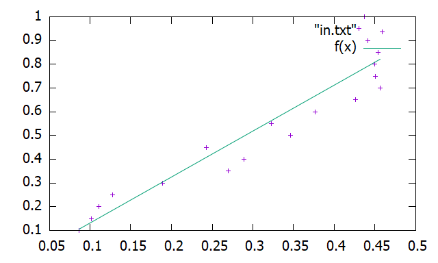

# Bonus(+5 marks) 
工作简要说明
1. 显示the image of Linear Regression 

2. 本地仓库，远程分github仓库的网址和截图）

3. 工作简要说明
本次作业中新安装了gunplot这个软件，gnuplot是一个命令行的交互式绘图工具，这个软件给c++提供了一个接口。c++调用这个接口后，就可以在c++里面编写gnuplot的东西。我们用c++把数据文件读取之后，通过使用gunplot的线性拟合命令，输出后便是以图形描述数据，使我们可以借由图形做更进一步的分析。 

       
          